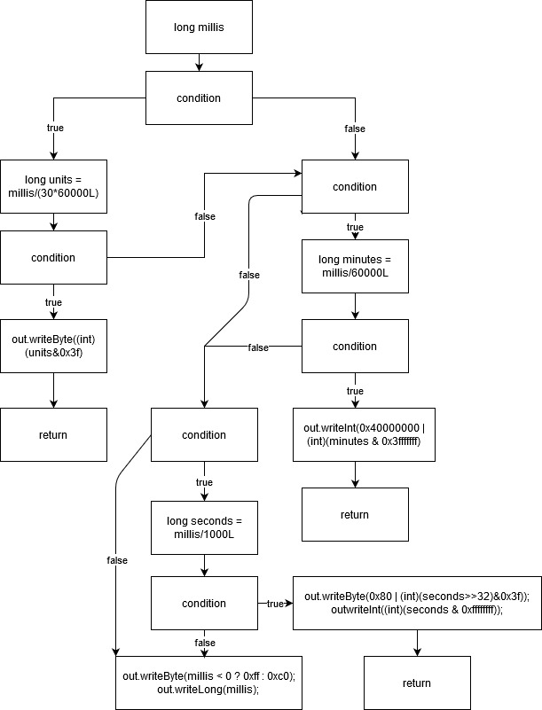

**Part 1**
Architecture of 3 packages and 10 classes

TEST123

Package: tz

1. Image
2. Image

**Part 2**

ZoneInfoCompiler.parseTime (Dean)
If/else

ZoneInfoCompiler.formatName (Jerome)
If/else

DateTimeZoneBuilder.writeMillis (Tony)
If/else

ZoneInfoProvider.openResource (Jerome)
If/else

ZoneInfoProvider.readZoneInfoMap (Dean)
For-loop

DateTimeZoneBuilder.isCachable (Tony)
For-loop

