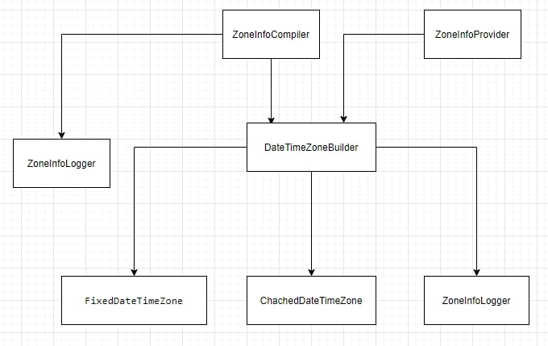
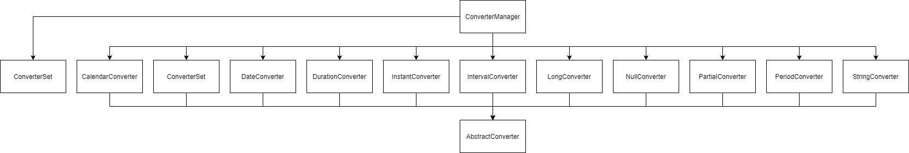
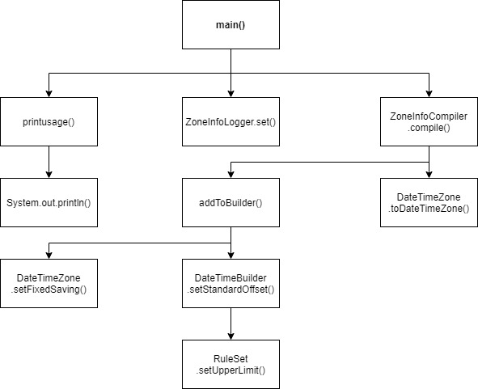
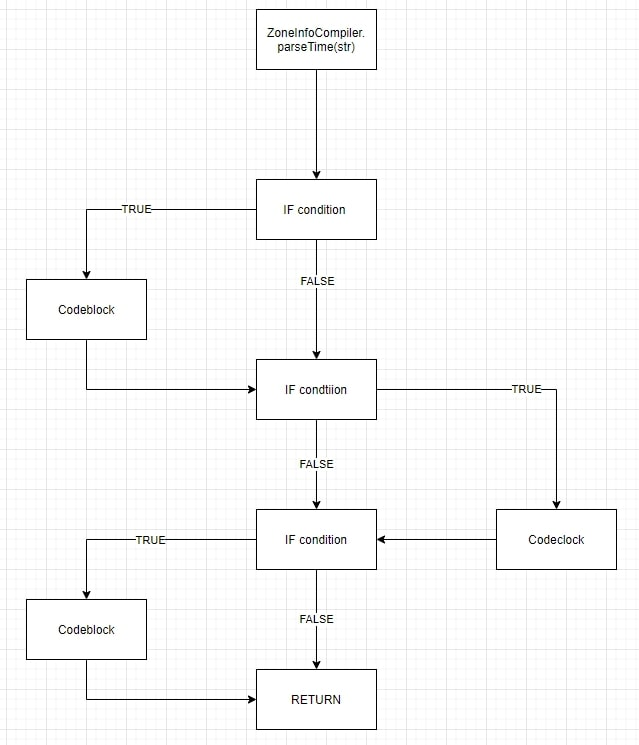
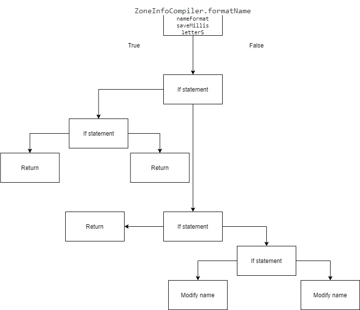
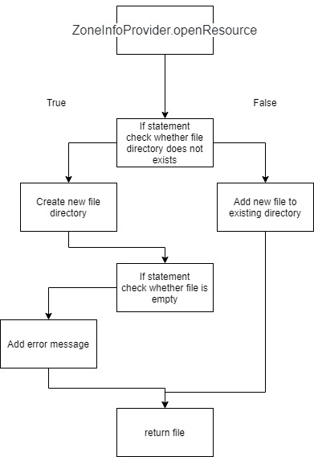
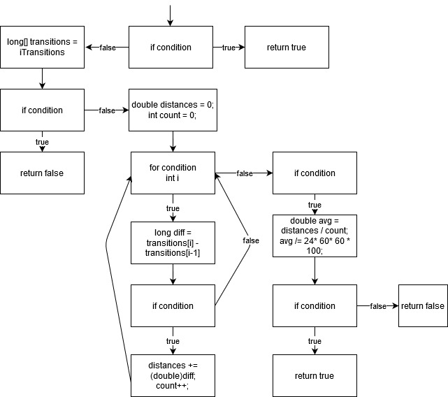

**Part 1**

**Part 1.1 Architecture of 3 packages and 10 classes**

Package: src.main.java.orga.joda.time.tz

Package: src.main.java.orga.joda.time.convert

**Part 1.2 Call Graph**

Call Graph

**Part 2**

ZoneInfoCompiler.parseTime
If/else

ZoneInfoCompiler.formatName
If/else

DateTimeZoneBuilder.writeMillis
If/else

ZoneInfoProvider.openResource
If/else

ZoneInfoProvider.readZoneInfoMap
For-loop

.jpg "readZoneInfoMap")

DateTimeZoneBuilder.isCachable
For-loop

