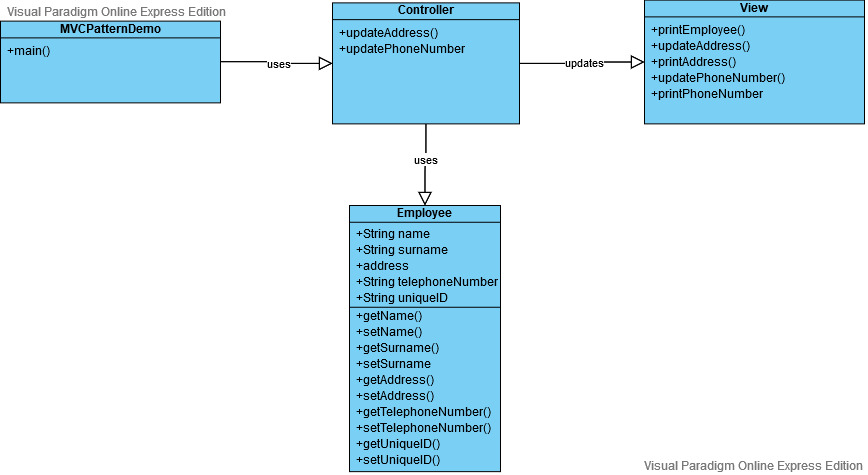

Exercise 1

Model class:        Employee-java
View class:         View.java
Controller class:   Controller.java
Testing class:      MVCPatternDemo.java

The MVCPatternDemo acts as a client and only calls the View class. 
The View class then either calls the Model directy (if it only needs to read info) or calls the Controller (if it wants to update something on the Model).

